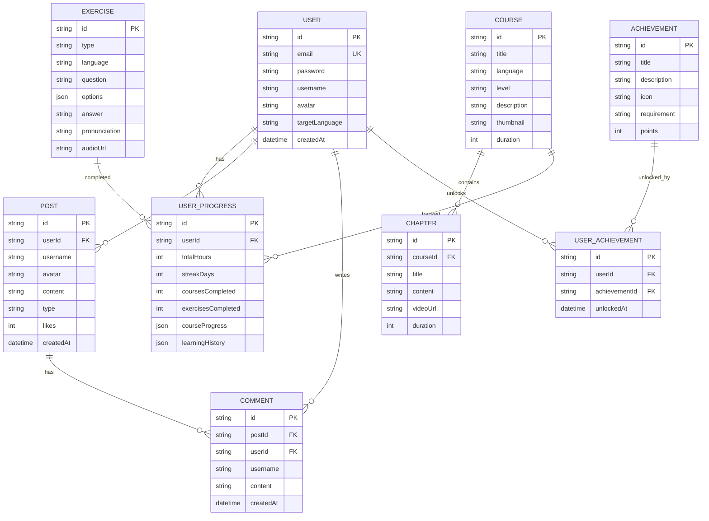

## 1. Architecture Design
多语种学习平台采用React + Express全栈架构，前端使用React构建现代化UI，后端使用Express提供RESTful API服务，数据存储使用文件存储实现持久化。

```mermaid
graph TB
    subgraph Frontend
        A[React App]
        B[Routing]
        C[State Management]
        D[Components]
    end
    
    subgraph Backend
        E[Express Server]
        F[API Routes]
        G[Controllers]
    end
    
    subgraph Data
        H[File Storage]
        I[Session Storage]
    end
    
    A --&gt; B
    B --&gt; C
    C --&gt; D
    A --&gt; E
    E --&gt; F
    F --&gt; G
    G --&gt; H
    G --&gt; I
```

## 2. Technology Description
- Frontend: React@18 + TypeScript + tailwindcss@3 + Vite + react-router-dom + zustand
- Initialization Tool: vite-init
- Backend: Express@4 + TypeScript
- Database: JSON File Storage（本地持久化）

## 3. Route Definitions
| Route | Purpose |
|-------|---------|
| / | 首页 |
| /login | 登录页面 |
| /register | 注册页面 |
| /courses | 课程中心 |
| /courses/:id | 课程详情 |
| /practice | 练习中心 |
| /progress | 学习进度 |
| /community | 社区交流 |
| /achievements | 成就系统 |

## 4. API Definitions
### 4.1 Auth API
```typescript
// POST /api/auth/register
interface RegisterRequest {
  email: string;
  password: string;
  username: string;
}

// POST /api/auth/login
interface LoginRequest {
  email: string;
  password: string;
}

interface AuthResponse {
  success: boolean;
  user: User;
  token: string;
}
```

### 4.2 Courses API
```typescript
// GET /api/courses
interface GetCoursesResponse {
  success: boolean;
  courses: Course[];
}

// GET /api/courses/:id
interface GetCourseResponse {
  success: boolean;
  course: Course;
}

// Course Interface
interface Course {
  id: string;
  title: string;
  language: string;
  level: 'beginner' | 'intermediate' | 'advanced';
  description: string;
  chapters: Chapter[];
  thumbnail: string;
  duration: number;
}

interface Chapter {
  id: string;
  title: string;
  content: string;
  videoUrl?: string;
  duration: number;
}
```

### 4.3 Practice API
```typescript
// GET /api/practice/:type
interface GetPracticeResponse {
  success: boolean;
  exercises: Exercise[];
}

interface Exercise {
  id: string;
  type: 'vocabulary' | 'grammar' | 'speaking' | 'listening';
  question: string;
  options?: string[];
  answer: string;
  pronunciation?: string;
  audioUrl?: string;
}
```

### 4.4 Progress API
```typescript
// GET /api/progress
interface GetProgressResponse {
  success: boolean;
  progress: UserProgress;
}

// POST /api/progress
interface UpdateProgressRequest {
  courseId: string;
  chapterId?: string;
  exerciseId?: string;
  completed: boolean;
  score?: number;
}

interface UserProgress {
  userId: string;
  totalHours: number;
  streakDays: number;
  coursesCompleted: number;
  exercisesCompleted: number;
  courseProgress: CourseProgress[];
  learningHistory: LearningRecord[];
}

interface CourseProgress {
  courseId: string;
  progress: number;
  chaptersCompleted: number;
  lastStudiedAt: string;
}

interface LearningRecord {
  date: string;
  hours: number;
  exercises: number;
}
```

### 4.5 Community API
```typescript
// GET /api/community/posts
interface GetPostsResponse {
  success: boolean;
  posts: Post[];
}

// POST /api/community/posts
interface CreatePostRequest {
  content: string;
  type: 'check-in' | 'sharing' | 'question';
}

interface Post {
  id: string;
  userId: string;
  username: string;
  avatar: string;
  content: string;
  type: 'check-in' | 'sharing' | 'question';
  likes: number;
  comments: Comment[];
  createdAt: string;
}

interface Comment {
  id: string;
  userId: string;
  username: string;
  content: string;
  createdAt: string;
}
```

### 4.6 Achievements API
```typescript
// GET /api/achievements
interface GetAchievementsResponse {
  success: boolean;
  achievements: Achievement[];
  unlocked: string[];
}

interface Achievement {
  id: string;
  title: string;
  description: string;
  icon: string;
  requirement: string;
  points: number;
}
```

## 5. Data Model
### 5.1 Data Model Definition


### 5.2 Initial Data
创建示例数据文件，包括用户、课程、练习、成就等初始数据。
