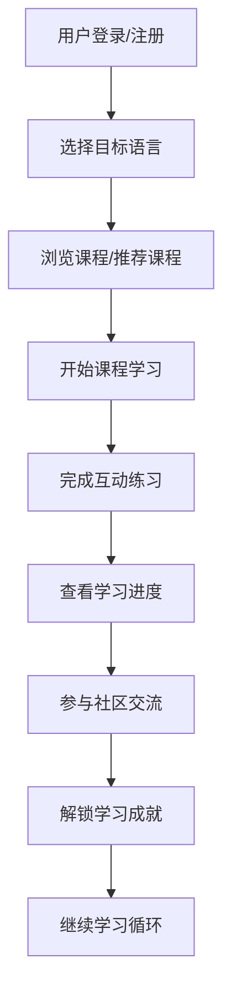

## 1. Product Overview
多语种学习在线教育平台，为用户提供沉浸式的语言学习体验，涵盖英语、日语、韩语等主流语言，通过分级课程、互动练习和社区激励系统帮助用户高效学习。
- 解决传统语言学习方法单调、缺乏个性化和互动性的问题，为各年龄段语言学习者提供一站式学习解决方案。

## 2. Core Features

### 2.1 User Roles
| Role | Registration Method | Core Permissions |
|------|---------------------|------------------|
| 普通用户 | 邮箱/手机号注册 | 学习课程、完成练习、查看进度、参与社区、获取成就 |

### 2.2 Feature Module
1. **首页**：英雄区、语言选择、课程推荐、学习进度概览
2. **登录/注册页**：用户身份验证、个人信息管理
3. **课程中心**：分级课程列表、课程详情、课程学习
4. **练习中心**：单词记忆、语法练习、口语跟读、听力训练
5. **学习进度**：学习数据可视化、学习记录、目标设定
6. **个性化推荐**：基于学习数据推荐适合的课程和练习
7. **社区交流**：学习打卡、学习心得分享、互动交流
8. **成就系统**：成就展示、成就解锁、激励机制

### 2.3 Page Details
| Page Name | Module Name | Feature description |
|-----------|-------------|---------------------|
| 首页 | 英雄区 | 品牌展示、学习入口、视觉冲击感设计 |
| 首页 | 语言选择 | 英语、日语、韩语、韩语等语言选择卡片 |
| 首页 | 课程推荐 | 基于用户偏好推荐热门课程 |
| 首页 | 学习进度概览 | 展示当前学习进度统计、进度条、成就图标 |
| 课程中心 | 分级课程 | 按难度分级的课程列表，包含课程预览、难度标签 |
| 课程详情页 | 课程内容 | 课程章节、学习时长、学习进度 |
| 练习中心 | 互动练习模块 | 单词记忆闪卡、语法选择、口语录音、听力填空 |
| 学习进度页 | 数据可视化 | 学习时长统计、完成率、学习 streak、学习日历 |
| 社区页 | 动态流 | 用户学习分享、点赞评论功能 |
| 成就页 | 成就展示 | 成就徽章、解锁条件、成就进度 |

## 3. Core Process
用户进入平台后，首先选择目标语言，然后浏览或被推荐课程，开始学习后完成配套练习，追踪学习进度，参与社区互动，获取学习成就。

## 4. User Interface Design
### 4.1 Design Style
- 主色调：蓝色系渐变（从深蓝到天蓝）
- 辅助色：活力橙、清新绿
- 按钮风格：圆角按钮，带有微动效，圆角12px
- 字体：Playfair Display（标题）+ Nunito（正文）
- 布局风格：卡片式布局，网格布局
- 图标/emoji风格：使用线性图标，简洁现代

### 4.2 Page Design Overview
| Page Name | Module Name | UI Elements |
|-----------|-------------|-------------|
| 首页 | 英雄区 | 全屏渐变背景，动态元素，大标题，动画入场 |
| 首页 | 语言选择 | 彩色渐变卡片，悬停上浮效果，图标动画 |
| 首页 | 进度概览 | 环形进度图，数据卡片，数字动画 |
| 练习中心 | 互动练习 | 卡片式练习，翻转效果，反馈动画 |
| 社区页 | 动态流 | 时间线布局，卡片式动态，交互反馈 |
| 成就页 | 成就展示 | 彩色徽章，解锁状态，进度动画 |

### 4.3 Responsiveness
- Desktop-first，移动端自适应设计
- 响应式断点：sm、md、lg、xl
- 触摸友好的按钮大小（≥44px）
- 平滑的滚动体验

